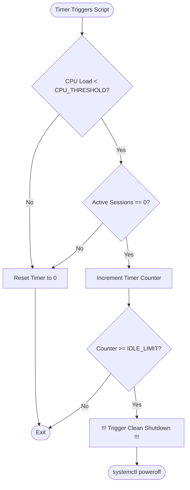

# 🧊 VM Idle Shutdown Monitor

A lightweight, automated systemd-based daemon to monitor a virtual machine's CPU load and active user sessions, automatically triggering a clean system shutdown when the VM remains idle beyond a configurable threshold. 

This is highly effective for cost optimization, preventing idle cloud VMs from running and billing continuously when not in use.

---

## ⚙️ How It Works

The system utilizes a lightweight bash script scheduled via a **Systemd Timer** to periodically check system activity. 



1. **CPU Monitoring**: Checks the 5-minute CPU load average from `/proc/loadavg`.
2. **Session Monitoring**: Verifies active interactive shell sessions (`ssh`, `bash`, `sh`, `pts` allocations, or `gcloud` console connections).
3. **Threshold Check**: If both CPU usage is below the configured threshold AND no user sessions are active, it increments a persistent idle counter stored in `/tmp/vm_idle_time`.
4. **Action**: If the counter reaches the `IDLE_LIMIT`, the system triggers `systemctl poweroff`. If any activity is detected before the limit is reached, the idle counter resets to `0`.

---

## 📁 File Structure

* **`idle-shutdown.sh`**: The core shell script that performs system checks, tracks idle duration, and executes the shutdown command.
* **`units/`**: Contains the systemd configuration units.
  * **`idle-shutdown.service`**: The systemd oneshot service configuration.
  * **`idle-shutdown.timer`**: The systemd timer that periodically triggers the idle-shutdown service.
* **`local/`**: Contains the local environment simulation/sandbox harness.
  * **`Dockerfile`**: A Debian Bookworm environment configured with systemd to simulate, test, and debug the setup locally inside a container.
  * **`run-test.sh`**: A shell utility to automatically build, run, and provide commands for inspecting the test container.

---

## 🛠️ Configuration

You can customize the thresholds by editing the top section of `idle-shutdown.sh`:

```bash
# Thresholds
CPU_THRESHOLD=0.10  # Maximum CPU average load (5-min) considered idle
IDLE_LIMIT=600      # Total idle duration in seconds before triggering shutdown (600s = 10 mins)
IDLE_FILE="/tmp/vm_idle_time"  # State file to track accumulated idle time
```

> [!NOTE]  
> The systemd timer is configured to run at custom intervals. You can adjust the execution frequency by modifying `idle-shutdown.timer`:
> - `OnBootSec`: Time to wait after system boot before the first check.
> - `OnUnitActiveSec`: The interval between subsequent checks (e.g., run every 5 minutes).

---

## 🚀 Production Deployment

To deploy this monitoring system on your VM, follow these steps:

### 1. Install Files to System Pathways
Copy the files into their corresponding system directories and make the script executable:

```bash
# Copy the script
sudo cp idle-shutdown.sh /usr/local/bin/idle-shutdown.sh
sudo chmod +x /usr/local/bin/idle-shutdown.sh

# Copy Systemd units
sudo cp units/idle-shutdown.service /etc/systemd/system/idle-shutdown.service
sudo cp units/idle-shutdown.timer /etc/systemd/system/idle-shutdown.timer
```

### 2. Enable and Start the Timer
Reload the systemd daemon configurations and enable the timer unit:

```bash
# Reload systemd
sudo systemctl daemon-reload

# Enable and start the timer immediately
sudo systemctl enable --now idle-shutdown.timer
```

### 3. Verify the Status
Confirm the timer is active and scheduled to run:

```bash
# Check the timer status
sudo systemctl status idle-shutdown.timer

# View active timers on the system
systemctl list-timers --all | grep idle-shutdown
```

---

## 🧪 Local Testing & Docker Simulation

This project includes a Docker-based test harness that boots a full Debian system running systemd, allowing you to safely test the script's behavior and systemd unit bindings without powering down your host machine.

### Prerequisites
- Docker installed on your host machine.
- User privileges to run docker (or `sudo` access).

### Run the Test Suite
Simply run the test runner script from the repository root:

```bash
./local/run-test.sh
```

This script will:
1. Stop and remove any previous test containers.
2. Build the Docker image containing systemd, our script, and service configurations.
3. Launch the container running systemd as PID 1 with required capabilities (`SYS_ADMIN`).

### Useful Commands for Debugging

* **Check the Status of the Timer inside the Container**:
  ```bash
  docker exec -it local-systemd-box systemctl status idle-shutdown.timer
  ```

* **Tail Script Execution Logs in Real-time**:
  ```bash
  docker exec -it local-systemd-box journalctl -u idle-shutdown.service -f
  ```

* **Manually Trigger a Check**:
  ```bash
  docker exec -it local-systemd-box systemctl start idle-shutdown.service
  ```

* **Clean Up the Test Container**:
  ```bash
  docker stop local-systemd-box && docker rm local-systemd-box
  ```

---

## ⚠️ Important Considerations

> [!WARNING]  
> If you are active in a SSH session on your VM, the script will detect your session under `ACTIVE_SESSIONS` and will **not** shutdown. However, as soon as you disconnect or if your terminal session times out, the active session count drops to `0`. If CPU load is also under `0.10`, the counter will begin ticking towards the shutdown limit. Ensure your session timeout settings and idle shutdown timer durations are aligned to prevent unexpected shutdowns while you are still working.
